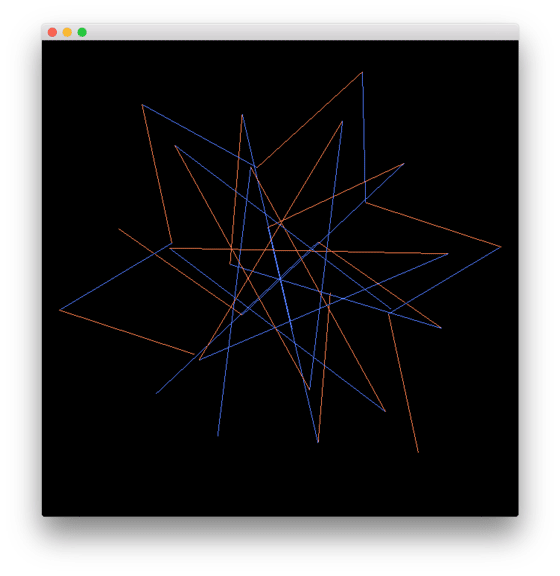

# ofxFractalGeometry
Set of functions useful for creating fractal geometry. 

## About
While working on [Non-Viral Series](http://www.pierdr.com/Non-viral-series) I used few helper functions to create fractal shapes, using recursion. I collected most of the functions I used in this openFramework addon.

## Developer guide
All the functions in ofxFractalGeometry are stastic functions.

To explore the functions see the [example code](fractalGeometryExample/src/testApp.cpp)

Tested on macOS 10.13 and of 0.9.8

## [Example](fractalGeometryExample/)
Shows how to use all the functions of the addon. You can cycle through all the helper functions just moving left and right with the arrow keys.

